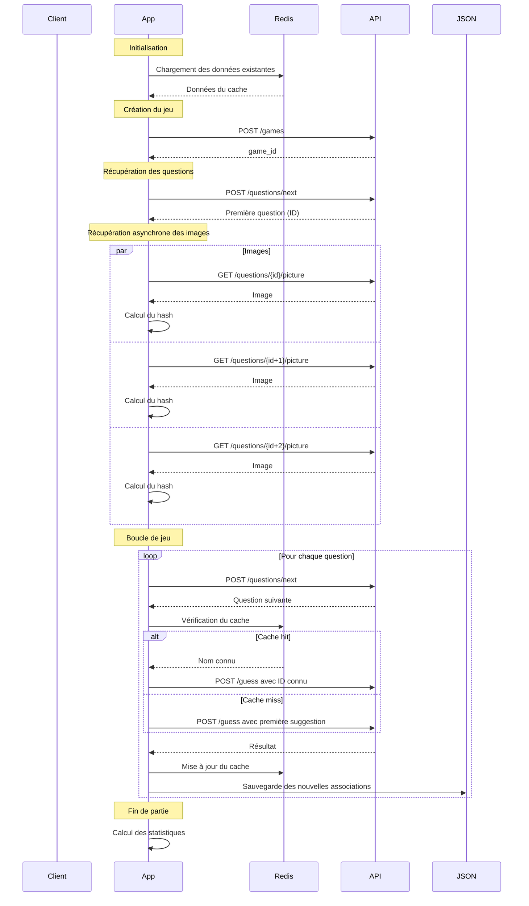

# Faces Solver

Un solveur pour le jeu Faces de Lucca, utilisant Redis pour le cache et des requêtes asynchrones pour optimiser les performances.

## Architecture



## Fonctionnalités

- Cache Redis pour les accès rapides aux associations hash-nom
- Persistance des données dans un fichier JSON
- Récupération asynchrone des images pour optimiser les performances
- Gestion des erreurs et logging détaillé
- Interface web pour la configuration et le suivi
- Vérification précise des réponses via `correctSuggestionId`

## Installation

1. Installer Redis :
```bash
# macOS
brew install redis
brew services start redis

# Linux
sudo apt-get install redis-server
sudo systemctl start redis
```

2. Installer les dépendances Python :
```bash
python -m venv .venv
source .venv/bin/activate
pip install -r requirements.txt
```

3. Lancer l'application :
```bash
./run.sh
```

## Configuration

L'application est configurable via les variables d'environnement :
- `FLASK_APP=app.py` : Fichier principal de l'application
- `FLASK_ENV=development` : Mode développement
- `FLASK_DEBUG=1` : Mode debug (optionnel)

## Structure du projet

```
faces_solver/
├── app.py              # Application Flask
├── main.py            # Script principal
├── cache_manager.py   # Gestionnaire de cache Redis
├── requirements.txt   # Dépendances Python
├── run.sh            # Script de démarrage
└── faces_data.json   # Données persistantes
```

## Optimisations

1. **Cache Redis** :
   - Index par hash d'image
   - Index par nom
   - Index par première lettre
   - Pipeline Redis pour les opérations en lot

2. **Requêtes asynchrones** :
   - Récupération parallèle des images
   - Réduction du temps d'attente
   - Meilleure utilisation des ressources

3. **Persistance** :
   - Sauvegarde automatique dans JSON
   - Chargement initial dans Redis
   - Synchronisation bidirectionnelle

## Logs

Les logs sont disponibles dans :
- Console : Logs en temps réel
- `app.log` : Fichier de logs détaillé

## Contribution

Les contributions sont les bienvenues ! N'hésitez pas à :
1. Fork le projet
2. Créer une branche pour votre fonctionnalité
3. Commiter vos changements
4. Pousser vers la branche
5. Ouvrir une Pull Request 