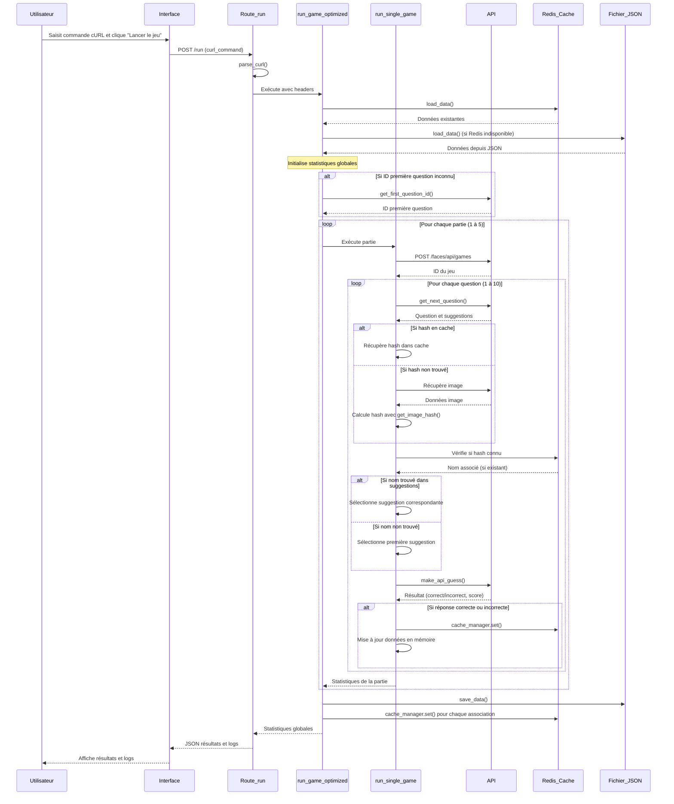

# Séquence d'exécution du jeu Faces Solver

Ce document détaille la séquence d'exécution complète lorsqu'un utilisateur lance le jeu via l'interface web.

## Séquence d'exécution

1. **Soumission du formulaire** - L'utilisateur saisit la commande cURL et clique sur "Lancer le jeu"
   - Le formulaire envoie une requête POST à la route `/run`

2. **Traitement de la requête** - Route `/run` dans `app.py`
   - Récupère les données du formulaire (commande cURL)
   - Vérifie le format de la requête (JSON ou formulaire standard)
   - Extrait la commande cURL

3. **Parsing de la commande cURL** - Fonction `parse_curl()`
   - Extrait les en-têtes et cookies de la commande cURL
   - Vérifie la présence des cookies d'authentification nécessaires
   - Retourne un dictionnaire contenant les en-têtes

4. **Lancement des parties optimisées** - Fonction `run_game_optimized()`
   - Charge les données existantes via `load_data()`
   - Initialise les statistiques globales
   - Détermine l'ID de la première question si nécessaire avec `get_first_question_id()`
   - Exécute plusieurs parties (par défaut 5) en boucle

5. **Exécution d'une partie** - Fonction `run_single_game()`
   - Crée un nouveau jeu via l'API (POST à `/faces/api/games`)
   - Récupère l'ID du jeu
   - Exécute une boucle de 10 questions

6. **Pour chaque question**:
   - Récupère la question suivante avec `get_next_question()`
   - Extrait l'ID de la question et les suggestions
   - Vérifie si un hash d'image est déjà en cache pour cette question
   - Si non en cache, récupère l'URL de l'image et calcule son hash avec `get_image_hash()`
   - Cherche si le hash correspond à un nom connu dans les données
   - Trouve la suggestion correspondante dans la liste des suggestions
   - Si aucune correspondance, utilise la première suggestion par défaut

7. **Soumission d'une réponse** - Fonction `make_api_guess()`
   - Prépare le payload avec l'ID de la question et l'ID de la suggestion
   - Envoie la réponse à l'API
   - Vérifie si la réponse est correcte en comparant `suggestionId` et `correctSuggestionId`
   - Met à jour les statistiques (score total, réponses correctes)

8. **Mise à jour du cache**
   - Si la réponse était correcte ou incorrecte, met à jour les données avec le nom correct
   - Enregistre l'association hash-nom dans Redis via `cache_manager.set()`

9. **Fin de partie et retour des résultats**
   - Calcule les statistiques finales (précision, nombre de bonnes réponses)
   - Sauvegarde les données mises à jour via `save_data()`
   - Renvoie les statistiques et logs au client

10. **Affichage des résultats** - Front-end (JavaScript)
    - Affiche les statistiques et logs dans l'interface utilisateur
    - Permet de lancer une nouvelle partie

## Diagramme de séquence

## Détail des fonctions principales

### `parse_curl(curl_command)`
- **Description**: Extrait les en-têtes et cookies d'une commande cURL
- **Entrée**: Commande cURL sous forme de chaîne
- **Sortie**: Dictionnaire contenant les en-têtes et l'URL

### `run_game_optimized(headers, game_number=1, total_games=5)`
- **Description**: Exécute plusieurs parties optimisées
- **Entrée**: En-têtes HTTP, nombre de parties à jouer
- **Sortie**: Statistiques globales et logs de toutes les parties

### `run_single_game(headers, estimated_question_id, data)`
- **Description**: Exécute une seule partie
- **Entrée**: En-têtes HTTP, ID de question estimé, données existantes
- **Sortie**: Statistiques de la partie

### `get_next_question(game_id, headers)`
- **Description**: Récupère la prochaine question du jeu
- **Entrée**: ID du jeu, en-têtes HTTP
- **Sortie**: Données de la question (ID, suggestions, URL d'image)

### `get_image_hash(image_url, headers)`
- **Description**: Télécharge une image et calcule son hash SHA-256
- **Entrée**: URL de l'image, en-têtes HTTP
- **Sortie**: Hash de l'image

### `make_api_guess(game_id, question_id, payload, headers)`
- **Description**: Envoie une réponse pour une question
- **Entrée**: ID du jeu, ID de la question, payload avec suggestionId, en-têtes HTTP
- **Sortie**: Résultat de la réponse (correct/incorrect, score)

### `load_data()`
- **Description**: Charge les données existantes depuis Redis et le fichier JSON
- **Entrée**: Aucune
- **Sortie**: Dictionnaire des associations hash-nom

### `save_data(data)`
- **Description**: Sauvegarde les données dans Redis et le fichier JSON
- **Entrée**: Dictionnaire des associations hash-nom
- **Sortie**: Aucune 