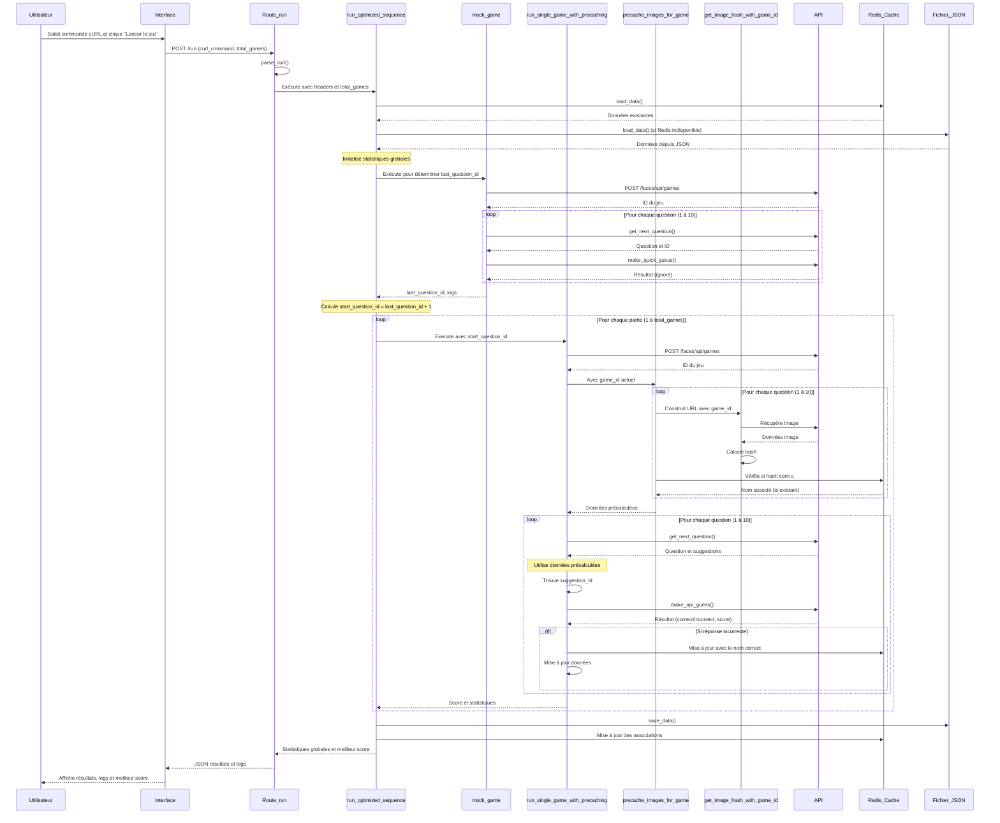

# Séquence d'exécution du jeu Faces Solver (Version Optimisée)

Ce document détaille la séquence d'exécution complète et optimisée lorsqu'un utilisateur lance le jeu via l'interface web.

## Séquence d'exécution

1. **Soumission du formulaire** - L'utilisateur saisit la commande cURL et clique sur "Lancer le jeu"
   - Le formulaire envoie une requête POST à la route `/run`
   - L'utilisateur peut spécifier le nombre de parties à jouer (défaut: 10)

2. **Traitement de la requête** - Route `/run` dans `app.py`
   - Récupère les données du formulaire (commande cURL, nombre de parties)
   - Vérifie le format de la requête (JSON ou formulaire standard)
   - Extrait la commande cURL et les paramètres

3. **Parsing de la commande cURL** - Fonction `parse_curl()`
   - Extrait les en-têtes et cookies de la commande cURL
   - Vérifie la présence des cookies d'authentification nécessaires
   - Retourne un dictionnaire contenant les en-têtes

4. **Lancement de la séquence optimisée** - Fonction `run_optimized_sequence()`
   - Charge les données existantes via `load_data()`
   - Initialise les statistiques globales
   - Procède en 2 phases principales:
     - Phase 1: "Mock Game" pour déterminer les IDs de questions
     - Phase 2: Exécution des parties réelles avec précaching intégré

5. **Phase 1: Mock Game** - Fonction `mock_game()`
   - Crée un nouveau jeu via l'API (POST à `/faces/api/games`)
   - Parcourt rapidement les 10 questions en faisant des suppositions arbitraires
   - Collecte le dernier ID de question (dernier `question_id`)
   - Détermine le premier ID de question pour les parties réelles (`last_question_id + 1`)

6. **Phase 2: Exécution des parties** - Fonction `run_single_game_with_precaching()`
   - Pour chaque partie:
     - **Étape 1**: Crée un nouveau jeu et obtient un `game_id` valide
     - **Étape 2**: Précalcule les hash des 10 images de cette partie via `precache_images_for_game()`
       - Utilise le `game_id` actuel pour construire les URLs d'images correctes
       - Récupère les images et calcule leurs hash via `get_image_hash_with_game_id()`
       - Vérifie si les hash correspondent à des noms connus dans les données
       - Stocke les associations hash-nom pour cette partie
     - **Étape 3**: Exécute la boucle principale du jeu (10 questions)
       - Pour chaque question:
         - Récupère la question via `get_next_question()`
         - Utilise les données précalculées pour trouver le nom associé
         - Cherche l'ID de suggestion correspondant au nom
         - Envoie la réponse via `make_api_guess()`
         - Enregistre le score et met à jour les statistiques
         - Met à jour le cache si nécessaire

7. **Mise à jour du cache et statistiques finales**
   - Calcule le score total et le meilleur score parmi toutes les parties
   - Calcule la précision globale (pourcentage de réponses correctes)
   - Sauvegarde les données mises à jour via `save_data()`
   - Renvoie les statistiques complètes et les logs au client

8. **Affichage des résultats** - Front-end (JavaScript)
   - Affiche les statistiques et logs dans l'interface utilisateur
   - Met en évidence le meilleur score et les performances par partie
   - Permet de lancer une nouvelle séquence

## Diagramme de séquence

## Détail des fonctions principales

### `parse_curl(curl_command)`
- **Description**: Extrait les en-têtes et cookies d'une commande cURL
- **Entrée**: Commande cURL sous forme de chaîne
- **Sortie**: Dictionnaire contenant les en-têtes et l'URL

### `run_optimized_sequence(headers, total_games=10)`
- **Description**: Exécute la séquence optimisée complète
- **Entrée**: En-têtes HTTP, nombre total de parties à jouer
- **Sortie**: Statistiques globales, meilleur score et logs

### `mock_game(headers)`
- **Description**: Exécute une partie rapide pour déterminer les IDs de questions
- **Entrée**: En-têtes HTTP
- **Sortie**: Dernier ID de question, logs de la partie

### `run_single_game_with_precaching(headers, start_question_id, data)`
- **Description**: Exécute une partie avec précalcul intégré des hash d'images
- **Entrée**: En-têtes HTTP, ID de question de départ, données existantes
- **Sortie**: Statistiques de la partie

### `precache_images_for_game(game_id, start_question_id, num_questions, headers, data)`
- **Description**: Précalcule les hash d'images pour un jeu spécifique
- **Entrée**: ID du jeu, ID de début, nombre de questions, en-têtes, données
- **Sortie**: Dictionnaire des données précalculées, logs

### `get_image_hash_with_game_id(game_id, question_id, headers)`
- **Description**: Télécharge une image et calcule son hash en utilisant un game_id
- **Entrée**: ID du jeu, ID de question, en-têtes HTTP
- **Sortie**: Hash de l'image

### `get_next_question(game_id, headers)`
- **Description**: Récupère la prochaine question du jeu
- **Entrée**: ID du jeu, en-têtes HTTP
- **Sortie**: Données de la question (ID, suggestions, URL d'image)

### `make_api_guess(game_id, question_id, payload, headers)`
- **Description**: Envoie une réponse pour une question
- **Entrée**: ID du jeu, ID de la question, payload avec suggestionId, en-têtes HTTP
- **Sortie**: Résultat de la réponse (correct/incorrect, score)

### `load_data()` et `save_data(data)`
- **Description**: Charge/sauvegarde les données depuis/vers Redis et le fichier JSON
- **Entrée/Sortie**: Dictionnaire des associations hash-nom

## Avantages de cette approche

1. **Conformité avec l'API**: Utilisation correcte des `game_id` pour accéder aux images
2. **Précaching efficace**: Précalcul des hash juste avant d'en avoir besoin, réduisant le temps de réponse pendant le jeu
3. **Robustesse accrue**: Mécanisme de fallback pour calculer les hash à la volée si nécessaire
4. **Performances optimisées**: Réduction du temps de traitement pendant la boucle principale de jeu
5. **Statistiques avancées**: Suivi des scores par partie et identification du meilleur score
6. **Mise à jour cohérente**: Association hash-nom actualisée pour chaque réponse correcte/incorrecte 